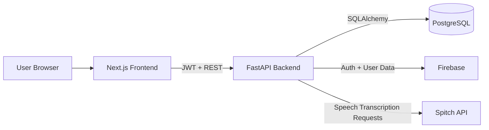

# 🗣️ Oyatalk

Oyatalk is a **web-based language learning app** that helps users learn **English and Nigerian languages (Yoruba, Igbo, Hausa)** through **speech-driven practice**. Built with modern web technologies and powered by the **Spitch speech-to-text API**, it provides real-time feedback on pronunciation and fluency, making language learning **fun, practical, and accessible**.

---

## Demo


--- 

## 🚀 Features

* 🎤 **Speak to Learn**: Practice phrases by speaking into your mic — Oyatalk listens and gives instant feedback.
* 📚 **Bilingual Lessons**: Learn **English** if you’re a Yoruba/Igbo/Hausa speaker, or practice Nigerian languages if you’re learning from English.
* 🏪 **Scenario-Based Learning**: Lessons are grouped into real-life contexts like **Market, Health, Transport, Work, and Polite Expressions**.
* ✅ **Smart Scoring**: Get detailed feedback on each word — see what’s correct, close, or wrong.
* 🔄 **Adaptive Practice**: Words or phrases you miss get added to a **Practice Again** deck for repetition.
* 📊 **Progress Tracking**: Track streaks, XP points, and view your learning history.
* 🏆 **Leaderboard**: Compete with other learners and climb to the top.
* 🌍 **Multilingual UI**: Navigate the app in English, Yoruba, Igbo, or Hausa.

---

## 🧩 How It Works

1. **Login/Register** – Simple email and password login.
2. **Choose a Language Goal** – Learn English, Yoruba, Igbo, or Hausa.
3. **Pick a Lesson** – Example: *At the Market*.
4. **Listen & Repeat** – Hear native audio, then speak into your mic.
5. **Get Feedback** – Oyatalk transcribes your speech, scores it, and highlights mistakes.
6. **Track Progress** – Earn XP, streaks, and badges as you improve.
7. **Climb the Leaderboard** – See how you rank against others.

---

## 🛠️ Tech Stack

* **Frontend**: React, TailwindCSS
* **Backend**: FastAPI (Python) with JWT Auth
* **Database**: PostgreSQL (via SQLAlchemy / Supabase)
* **Speech-to-Text**: [Spitch API](https://spitch.app)
* **Deployment**: Vercel (frontend) + Render (backend)

---

## 🏗️ Architecture



---

## 🐳 Docker (frontend + backend)

1. Create a `.env` file in the repo root with the values your deployment needs (defaults shown):

	```env
	NEXT_PUBLIC_API_URL=http://backend:8000
	_DATABASE_URL=postgresql://postgres:postgres@db:5432/oyatalk
	FIREBASE_CREDENTIALS_JSON=<paste your Firebase service-account JSON as a single line>
	SPITCH_API_KEY=
	SPITCH_API_URL=https://api.spitch.app/v1/transcribe
	```

2. Build the images (targets `frontend` and `backend` live in the shared Dockerfile):

	```bash
	docker compose build
	```

3. Start both services:

	```bash
	docker compose up -d
	```

4. Access the apps:
	* Frontend: http://localhost:3000
	* Backend: http://localhost:8000/health

5. Notes:
	* Default `_DATABASE_URL` is PostgreSQL. Set credentials/host for your environment.
	* `FIREBASE_CREDENTIALS_JSON` must be valid JSON (minify the service account file or wrap it in single quotes).
	* Rebuild after dependency changes: `docker compose build --no-cache`.

---

## 📖 Example Lessons

* **English**: *Hello, how are you?*, *Where is the bathroom?*, *I don’t understand.*
* **Yoruba**: *Báwo ni?*, *Mo fẹ́ ra ìrẹsì.*
* **Igbo**: *Kedu?*, *Achọrọ m ịhụ dọkịta.*
* **Hausa**: *Sannu, ya ya kake?*, *Ina tashar mota?*

---

## 🌍 Why Oyatalk?

* Tackles **real communication problems** in Nigeria: healthcare, education, markets, emergencies.
* Bridges the gap between **English proficiency** and **local language preservation**.
* Makes learning **fun, gamified, and culturally relevant**.


---

## 🚧 Status

**v1.0 - actively maintained.** Planned improvements include:

* Phoneme-level pronunciation tips.
* Conversation simulations (e.g., doctor–patient roleplay).
* Offline-first mobile support.

---

## 📜 License

MIT License. Free to use and extend.

---

